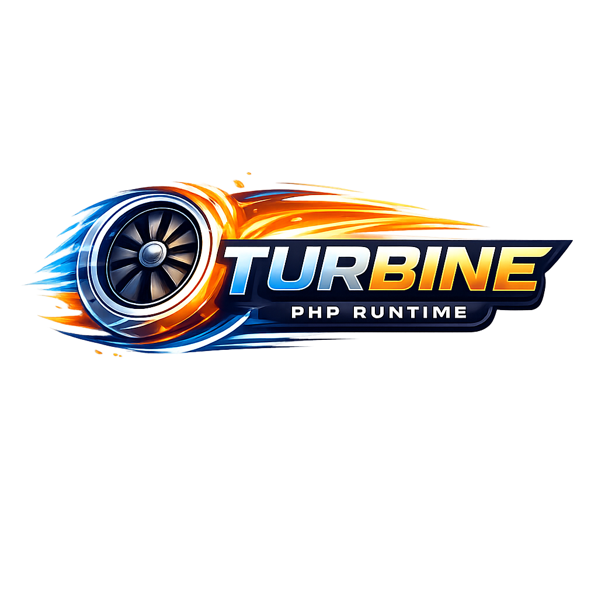

# Turbine

<p align="center">
  
</p>

High-performance PHP application server written in Rust, powered by the PHP embed SAPI — with a **built-in OWASP security layer** that replaces ModSecurity and external WAFs at ~500 ns overhead.

Turbine replaces the traditional **Nginx + PHP-FPM + OPcache** stack with a single binary that embeds PHP directly, eliminating inter-process communication overhead and reducing latency. Security guards (SQL injection, code injection, path traversal, behaviour analysis) run inside the same process — no extra hop, no extra service.

> [!WARNING]
> **This project is under active development and is not yet ready for production use.**
> APIs, configuration format, and behaviour may change without notice.
> You are welcome to try it out using the example projects in [`examples/`](examples/) and [`laravel-test/`](laravel-test/).
> Bug reports, feedback, and pull requests are very welcome — contributions of any kind are greatly appreciated.

## Features

- **Single binary** — no Nginx, no PHP-FPM, no reverse proxy
- **Persistent workers** — process and thread modes with automatic scaling
- **Zero-copy IPC** — in-memory channels for thread mode (ZTS), up to **67k req/s** on Apple M1 Pro
- **OWASP security guards** — SQL injection, code injection, path traversal, behaviour analysis — all in Rust, ~500 ns overhead, zero external WAF needed
- **ACME auto-TLS** — automatic Let's Encrypt certificates
- **Virtual hosting** — multiple domains on one server, SNI per-host TLS
- **OPcache preload** — bytecode compiled once and kept in memory across all workers (not just per-process OPcache)
- **Hot reload** — file watcher for development
- **Framework support** — Laravel, Symfony, Phalcon, WordPress
- **Structured logging** — JSON output, Datadog/Loki compatible
- **Compression** — Brotli, Zstd, Gzip
- **Early Hints** — HTTP 103 support
- **X-Sendfile** — efficient large file delivery
- **App embedding** — pack your entire PHP application into a single self-contained binary for distribution
- **Built-in observability** — Prometheus metrics, live dashboard, per-IP blocked request log

## Security — Built-in, Zero Overhead

Turbine includes a **multi-layered OWASP security system** written in Rust that runs inside the process — no ModSecurity, no WAF appliance, no extra hop.

```
Request → Execution Whitelist → Data Directory Guard → Path Guard
        → SQL Injection Guard → Code Injection Guard → Behaviour Guard
        → PHP Execution
```

Each guard is an Aho-Corasick automaton (~150 ns). Total overhead across all guards: **~500 ns per request** — negligible compared to PHP execution time.

| Guard | What it blocks | Overhead |
|-------|---------------|----------|
| **SQL Injection** | `UNION SELECT`, `SLEEP()`, `WAITFOR DELAY`, `LOAD_FILE`, stacked queries, hex obfuscation, 36 patterns | ~150 ns |
| **Code Injection** | `eval()`, `system()`, `shell_exec()`, obfuscation chains (`eval(base64_decode(…))`), backtick, `ReflectionFunction`, 36 patterns | ~100–200 ns |
| **Behaviour Guard** | Rate limiting per IP, scanning detection (high 4xx rate), SQLi accumulation → permanent IP block | ~200 ns |
| **Path Guard** | `../` traversal, null bytes, double-encoding | ~50 ns |
| **Execution Whitelist** | Only whitelisted PHP files are executable via HTTP | O(1) hash |
| **Data Dir Guard** | PHP execution inside `uploads/`, `storage/` is always blocked | O(1) |

POST bodies (JSON and form-encoded) are also scanned — not just query strings.

All guards are enabled by default. Toggle individually in `turbine.toml`:

```toml
[security]
enabled                = true
sql_guard              = true
code_injection_guard   = true
path_traversal_guard   = true
behaviour_guard        = true
max_requests_per_second = 100
sqli_block_threshold   = 3      # block IP after N SQLi attempts
```

> **Try it live:** the [`examples/raw-php/security-demo`](examples/raw-php/security-demo/) example ships an interactive browser UI where you can fire every attack type and watch them blocked in real time.

See [docs/security.md](docs/security.md) for the full reference.

## Quick start

```bash
# Create a PHP project directory
mkdir myapp && cd myapp

# Generate default configuration
turbine init

# Create a test page
echo '<?php echo "Hello from Turbine!";' > index.php

# Start the server
turbine serve --root .
```

Open http://127.0.0.1:8080 in your browser.

### Runtime library path

On macOS, set the library path before running:

```bash
# NTS
export DYLD_LIBRARY_PATH="/path/to/vendor/php-embed/lib"

# ZTS
export DYLD_LIBRARY_PATH="/path/to/vendor/php-embed-zts/lib"
```

On Linux, use `LD_LIBRARY_PATH` instead.

## Worker Modes

> **The most important choice before deploying Turbine.** Choose at build time — process and thread modes require different PHP builds (NTS vs ZTS).

Turbine has two worker backends:

| Mode | `worker_mode` | PHP Build | Isolation | When to use |
|------|--------------|-----------|-----------|-------------|
| **Process** (default) | `"process"` | NTS or ZTS | Each worker = separate OS process | Default. Any extension, full crash isolation |
| **Thread** | `"thread"` | **ZTS only** | One process, N threads (TSRM) | Maximum throughput, ZTS-safe extensions |

```toml
[server]
# Process mode — default, works with any PHP extension
worker_mode = "process"

# Thread mode — ZTS PHP required, highest throughput
# worker_mode = "thread"
```

**Process mode** forks one OS process per worker. A crash in one worker is isolated — others keep running. Works with NTS or ZTS PHP.

**Thread mode** spawns OS threads sharing one address space. Uses in-memory channels (zero `pipe(2)` syscalls) instead of pipes, and workers communicate as Rust structs rather than serialized bytes. Requires PHP compiled with `--enable-zts` (use `./build.sh` → *Thread mode (ZTS)*). A PHP segfault takes down all threads.

See [docs/worker.md](docs/worker.md) for the full guide, ZTS extension compatibility, and benchmarks.

## Requirements

- **Rust** 1.75+ (install via [rustup](https://rustup.rs))
- **PHP 8.1+** source or embed SAPI library
- **macOS** or **Linux** (x86_64 / aarch64)

### macOS build dependencies

```bash
brew install autoconf automake bison re2c pkg-config \
    openssl@3 libxml2 icu4c libzip oniguruma curl \
    libsodium libpng libjpeg-turbo freetype gd
```

### Linux build dependencies (Debian/Ubuntu)

```bash
apt install build-essential autoconf automake bison re2c pkg-config \
    libssl-dev libxml2-dev libicu-dev libzip-dev libonig-dev libcurl4-openssl-dev \
    libsodium-dev libpng-dev libjpeg-dev libfreetype-dev libgd-dev
```

## Building

The easiest way to build Turbine is with the interactive build script:

```bash
./build.sh
```

The script walks you through every step with a keyboard-driven UI:

1. **Build mode** — choose with arrow keys + Enter:
   - `Process mode (NTS)` — fork-based workers, max compatibility
   - `Thread mode (ZTS)` — in-memory channel workers, max throughput
   - `Both (NTS + ZTS)` — build both variants

2. **PHP version** — defaults to `8.4.6`, enter any `x.y.z` release

3. **PECL extensions** — toggle with Space, confirm with Enter:
   - `Phalcon` — high-performance PHP framework (C extension)
   - `Redis` — PHP Redis client
   - `Imagick` — ImageMagick bindings
   - `APCu` — user data cache
   - `Xdebug` — debugger and profiler (dev only)

4. **Release or debug** build

After confirmation, the script downloads the PHP source, compiles it with the embed SAPI and 45+ extensions, installs PECL extensions, and builds Turbine. Output:

| Build | PHP install path | Turbine binary |
|-------|-----------------|----------------|
| NTS | `vendor/php-embed/` | `target/release/turbine` |
| ZTS | `vendor/php-embed-zts/` | `target/release/turbine` |

> **Note:** `vendor/` is excluded from git. Every developer runs `./build.sh` once after cloning.

### Manual build

If you prefer to build manually:

```bash
# 1. Compile PHP with embed SAPI
# NTS
./scripts/build-php-embed.sh
# ZTS
ZTS_BUILD=1 ./scripts/build-php-embed.sh

# 2. Build Turbine
# NTS
PHP_CONFIG=$PWD/vendor/php-embed/bin/php-config cargo build --release
# ZTS
PHP_CONFIG=$PWD/vendor/php-embed-zts/bin/php-config cargo build --release
```

The binary is at `target/release/turbine`.

## Configuration

Create a `turbine.toml` in your project root:

```toml
[server]
workers = 0               # 0 = auto-detect (CPU cores)
listen = "127.0.0.1:8080"
worker_mode = "thread"     # "process" or "thread" (ZTS required)
request_timeout = 30       # seconds, 0 = no timeout
worker_max_requests = 1000 # respawn after N requests (0 = never)

[php]
extension_dir = ""         # auto-detected if empty
ini = { "memory_limit" = "256M", "upload_max_filesize" = "50M" }

[security]
enabled = true
sql_guard = true
path_traversal_guard = true
code_injection_guard = true
behaviour_guard = true

[sandbox]
seccomp = true             # Linux only
execution_mode = "framework"

[logging]
level = "info"             # trace, debug, info, warn, error

[dashboard]
enabled = true             # /_/dashboard HTML page
statistics = true          # /_/metrics and /_/status endpoints
# token = "my-secret"     # Bearer token for all /_/* endpoints (header only)
```

See [docs/config.md](docs/config.md) for the full configuration reference.

## TLS

```bash
# Manual certificates
turbine serve --tls-cert cert.pem --tls-key key.pem

# Automatic Let's Encrypt (configure in turbine.toml)
```

See [docs/tls.md](docs/tls.md) for ACME auto-TLS setup.

## Benchmarks

> Apple M1 Pro, 10 cores, PHP 8.5.4, `wrk -t4 -c100 -d30s`. Full results in `dev/tideways-bench/results/`.

| Server | Hello World (req/s) | HTML 50 KB (req/s) | HTML 50 KB p99 latency |
|--------|--------------------:|--------------------|------------------------|
| **Turbine thread, 8w (ZTS)** | **67,467** | **46,390** | **438 µs** |
| **Turbine process, 8w (NTS)** | **64,023** | **45,143** | 421 µs |
| PHP-FPM + nginx | 51,353 | 21,686 | **165 ms** (spikes) |
| FrankenPHP (worker mode) | 41,123 | 17,714 | 738 µs |

Turbine thread mode peaks at **67k req/s** (Hello World) and **46k req/s** (50 KB HTML). For larger real-world responses, PHP-FPM's p99 latency spikes to hundreds of milliseconds under load; Turbine stays sub-millisecond.

See [docs/performance.md](docs/performance.md) for tuning guidance and persistent worker benchmarks.

## Documentation

| Topic | Link |
|-------|------|
| Architecture | [docs/README.md](docs/README.md) |
| **Worker modes** | [**docs/worker.md**](docs/worker.md) — process vs thread, the key choice |
| Configuration reference | [docs/config.md](docs/config.md) |
| Building from source | [docs/compile.md](docs/compile.md) |
| **Security model** | [**docs/security.md**](docs/security.md) — OWASP guards, sandbox, PHP hardening |
| **Dashboard & Internal API** | [**docs/dashboard.md**](docs/dashboard.md) — UI panels, blocked IPs, Prometheus, cache clear |
| Performance | [docs/performance.md](docs/performance.md) |
| Laravel integration | [docs/laravel.md](docs/laravel.md) |
| TLS & ACME | [docs/tls.md](docs/tls.md) |
| **Virtual hosting** | [**docs/virtual-hosts.md**](docs/virtual-hosts.md) — multiple domains, SNI, ACME |
| PHP extensions | [docs/extensions.md](docs/extensions.md) |
| Migration from Nginx | [docs/migrate.md](docs/migrate.md) |

## Project structure

```
crates/
  turbine-core/       Main server, CLI, HTTP handling
  turbine-php-sys/    PHP FFI bindings, embed SAPI integration
  turbine-engine/     PHP engine lifecycle management
  turbine-worker/     Worker pool (process & thread modes)
  turbine-security/   OWASP security guards, sandbox
  turbine-metrics/    Performance metrics
  turbine-cache/      Response caching
```

## License

Turbine is **dual-licensed**:

| Use case | License |
|----------|---------|
| Open-source projects (AGPL-compliant) | [AGPL-3.0](LICENSE) — free |
| Proprietary / SaaS / no source-disclosure | [Commercial License](LICENSE-COMMERCIAL) — contact for pricing |

If your application is open source and you can comply with the AGPL-3.0 copyleft terms (network use triggers source disclosure), the AGPL license is free. If you are building a proprietary product or SaaS platform where the AGPL is not acceptable, purchase a commercial license.

**Commercial license enquiries:** dener.php@gmail.com
